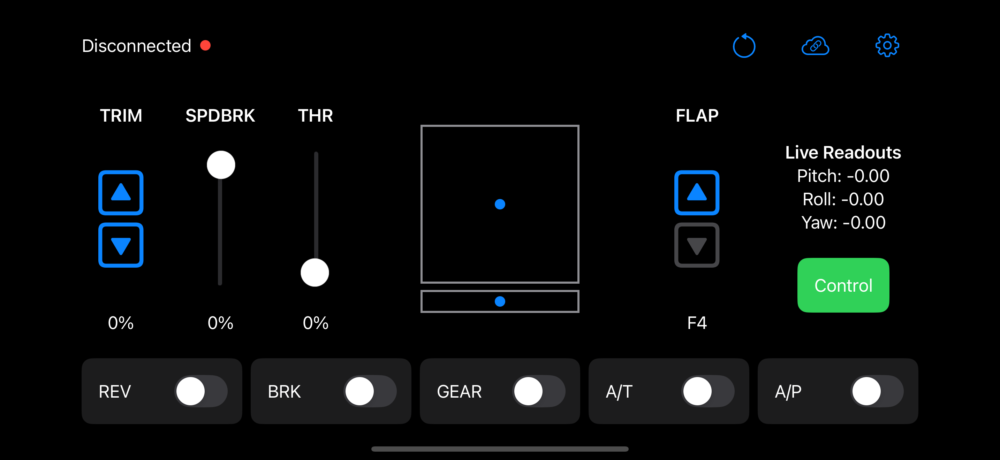

# AvioConnect
Effortlessly synchronize an iOS-device–equipped device using IMU readouts to control X-Plane 12 aircraft natively and precisely. Featuring customizable datarefs and smooth roll, pitch, toggletable yaw control, and others, AvioConnect redefines control for desktop flight simulation.

## Planned Features
- ~~Improved UI layout and better compatibility with iPad devices~~ [X] COMPLETE
- ~~More aircraft controls, including autopilot and brakes toggles~~ [X] COMPLETE
- ~~User customizable datarefs with local configuration files~~ [X] COMPLETE

## Known Issues
None currently
